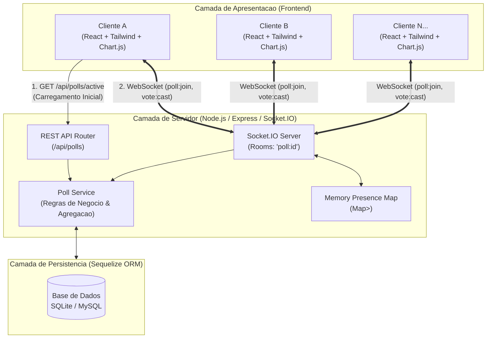
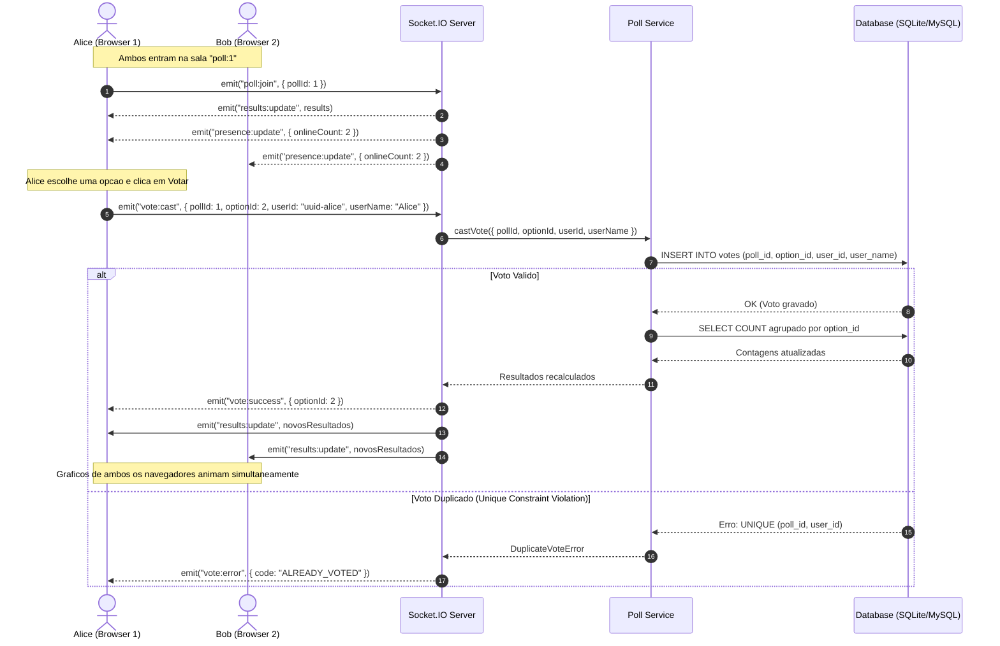
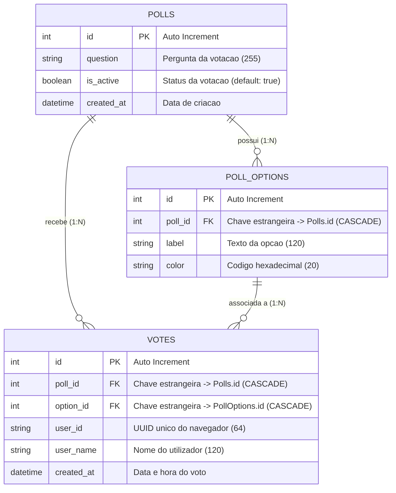

# Real-Time Poll

> **Aplicacao de Votacao em Tempo Real** — Sistema distribuido de votacao e agregacao estatistica instantanea com arquitetura orientada a eventos (*event-driven*), garantia de integridade contra votos duplicados em nivel de base de dados e sincronizacao bidirecional via WebSockets.

---

## Indice

- [Visao Geral](#visao-geral)
- [Arquitetura do Sistema](#arquitetura-do-sistema)
  - [Diagrama de Arquitetura Geral](#diagrama-de-arquitetura-geral)
  - [Fluxo de Votacao e Broadcast em Tempo Real](#fluxo-de-votacao-e-broadcast-em-tempo-real)
  - [Modelo de Dados (ERD)](#modelo-de-dados-erd)
- [Principais Decisoes Tecnicas](#principais-decisoes-tecnicas)
  - [Garantia Contra Votos Duplicados (Race Conditions)](#1-garantia-contra-votos-duplicados-race-conditions)
  - [Calculo e Agregacao Dinamica](#2-calculo-e-agregacao-dinamica)
  - [Persistencia e Sessao Sem Autenticacao Pesada](#3-persistencia-e-sessao-sem-autenticacao-pesada)
  - [Zero-Config Database: SQLite + Suporte a MySQL](#4-zero-config-database-sqlite--suporte-a-mysql)
- [Stack Tecnologica](#stack-tecnologica)
- [Estrutura do Repositorio](#estrutura-do-repositorio)
- [Como Correr Localmente](#como-correr-localmente)
  - [Pre-requisitos](#pre-requisitos)
  - [1. Backend (API + WebSockets)](#1-backend-api--websockets)
  - [2. Frontend (React + Vite)](#2-frontend-react--vite)
- [Testar Concorrencia e Tempo Real](#testar-concorrencia-e-tempo-real)

---

## Visao Geral

- **Sincronizacao Instantanea**: Varios utilizadores conectados visualizam em simultaneo os graficos a atualizar-se em tempo real assim que qualquer voto e submetido.
- **Identificacao Desacoplada**: Sem palavras-passe ou formularios complexos. O utilizador informa apenas um nome e recebe um UUID persistente via `localStorage`.
- **Prevencao de Votos Duplos**: Garantida atomicamente por *Unique Constraints* na base de dados, tolerante a cliques simultaneos em multiplas abas ou conexoes concorrentes.
- **Metricas de Presenca**: Contagem em tempo real de utilizadores conectados na sala da votacao.
- **Resiliencia e Carregamento Hibrido**: Carregamento inicial rapido via REST (evita telas em branco) combinado com escuta ativa via WebSockets.

---

## Arquitetura do Sistema

### Diagrama de Arquitetura Geral



---

### Fluxo de Votacao e Broadcast em Tempo Real



---

### Modelo de Dados (ERD)



> **Indice de Integridade**: `VOTES` possui um indice unico composto em `(poll_id, user_id)` garantindo que nenhum registo duplicado passe para a base de dados.

---

## Principais Decisoes Tecnicas

### 1. Garantia Contra Votos Duplicados (*Race Conditions*)
- **Problema**: Checagens exclusivamente em memoria ou no cliente (*Client-side checks*) falham quando o mesmo utilizador emite cliques muito rapidos em abas diferentes ou sofre oscilacoes de rede.
- **Solucao**: Criada uma restricao unica a nivel de banco de dados:
  ```sql
  UNIQUE INDEX unique_vote_per_user_per_poll ON votes (poll_id, user_id);
  ```
  Caso duas requisicoes paralelas cheguem milissegundos uma da outra, o motor da base de dados aceita a primeira e rejeita atomicamente a segunda com `UniqueConstraintError`, mapeado no backend para `DuplicateVoteError`.

### 2. Calculo e Agregacao Dinamica
- **Fonte Unica da Verdade**: Os totais e percentagens nao sao salvos em contadores mutaveis suscetiveis a dessincronizacao. Em cada novo voto, uma query agregada `COUNT` e executada:
  ```sql
  SELECT option_id, COUNT(id) as count FROM votes WHERE poll_id = :pollId GROUP BY option_id;
  ```
- **Precisao**: Percentagens calculadas matematicamente com arredondamento a uma casa decimal `(votos / total) * 100`.

### 3. Persistencia e Sessao Sem Autenticacao Pesada
- Ao carregar a pagina pela primeira vez, o cliente gera um identificador aleatorio seguro (`crypto.randomUUID()`) e salva-o em `localStorage`.
- Se o navegador recarregar, o hook `usePoll` consulta o endpoint `/api/polls/:id/my-vote` e recupera instantaneamente a opcao votada, mantendo o estado correto na UI.

### 4. Zero-Config Database: SQLite + Suporte a MySQL
- **Zero Configuracao Local**: Por padrao, o backend utiliza **SQLite** gerando o ficheiro local `database.sqlite` sem necessidade de instalar servidores externos de base de dados.
- **Pronto para Producao**: Basta alterar `DATABASE_URL` no `.env` para apontar para um cluster MySQL (`mysql://...`) sem alterar uma unica linha de codigo.

---

## Stack Tecnologica

| Camada | Tecnologia | Proposito / Beneficio |
|---|---|---|
| **Frontend Framework** | React 19 + Vite | Renderizacao rapida com SSR/Lazy safety e inicializacao otimizada |
| **Estilizacao** | Tailwind CSS 4 | Tema *Control Room* escuro com paleta industrial de alto contraste |
| **Graficos** | Chart.js + react-chartjs-2 | Visualizacao horizontal reativa com interpolacao de cores e animacoes fluidas |
| **WebSockets** | Socket.IO + Socket.IO-Client | Comunicacao bidirecional orientada a salas (*rooms*) com auto-reconexao e fallback HTTP |
| **Backend Runtime** | Node.js + Express 5 | Servidor HTTP moderno com arquitetura modular |
| **ORM / Banco de Dados** | Sequelize + SQLite / MySQL | Mapeamento relacional com suporte hibrido SQLite/MySQL |

---

## Estrutura do Repositorio

```
realtime-poll/
├── backend/
│   ├── src/
│   │   ├── db/
│   │   │   ├── connection.js       # Conexao hibrida Sequelize (SQLite / MySQL)
│   │   │   ├── seed.js             # Script de populacao da votacao de demonstracao
│   │   │   └── models/             # Definicoes dos modelos (Poll, PollOption, Vote)
│   │   ├── routes/
│   │   │   └── poll.routes.js      # Rotas REST (/active, /results, /my-vote)
│   │   ├── services/
│   │   │   └── poll.service.js     # Logica de negocio, agregacoes e queries
│   │   ├── sockets/
│   │   │   └── index.js            # Handlers de eventos WebSocket e salas
│   │   └── index.js                # Entrada da aplicacao e orquestracao HTTP/WS
│   ├── Dockerfile                  # Containerizacao de producao
│   ├── package.json
│   ├── .env.example
│   └── README.md                   # Documentacao tecnica aprofundada do Backend
│
├── docker-compose.yml              # Orquestracao Docker multi-container
└── frontend/
    ├── src/
    │   ├── components/
    │   │   ├── LiveBadge.jsx       # Indicador de status de conexao e utilizadores online
    │   │   ├── NameEntry.jsx       # Formulario inicial de identificacao do utilizador
    │   │   ├── ResultsChart.jsx    # Grafico de barras horizontais Chart.js
    │   │   └── VotingPanel.jsx     # Botoes e painel de votacao
    │   ├── hooks/
    │   │   └── usePoll.js          # Hook de orquestracao WebSocket e ciclo de vida
    │   ├── lib/
    │   │   ├── config.js           # Endpoints de API e Socket
    │   │   └── userId.js           # Geracao e persistencia resiliente de UUID
    │   ├── App.jsx                 # Maquina de estados principal da interface
    │   ├── index.css               # Design tokens Tailwind CSS 4
    │   └── main.jsx
    ├── package.json
    ├── .env.example
    └── README.md                   # Documentacao tecnica aprofundada do Frontend
```

---

## Como Correr Localmente

### Pre-requisitos
- **Node.js**: Versao 18 ou superior (`node -v`)
- **NPM**: Versao 9 ou superior (`npm -v`)

---

### 1. Backend (API + WebSockets)

```bash
cd backend

# 1. Instalar dependencias
npm install

# 2. Configurar variaveis de ambiente (ja vem pre-configurado para SQLite)
cp -n .env.example .env

# 3. Criar e popular a base de dados de exemplo
npm run seed

# 4. Iniciar o servidor em desenvolvimento
npm run dev
```

> Servidor backend ativo em `http://localhost:4000` (Healthcheck: `http://localhost:4000/health`)

---

### 2. Frontend (React + Vite)

Abra um novo terminal:

```bash
cd frontend

# 1. Instalar dependencias
npm install

# 2. Configurar variaveis de ambiente
cp -n .env.example .env

# 3. Iniciar o frontend
npm start
```

> Interface disponivel em `http://localhost:5173`

---

## Testar Concorrencia e Tempo Real

1. Abra `http://localhost:5173` no navegador normal e insira o nome **Alice**.
2. Abra `http://localhost:5173` numa **janela anonima** (ou noutro navegador) e insira o nome **Bob**.
3. Observe o badge superior: ambos mostrarao **`2 online`**.
4. Vote com a **Alice**: instantaneamente, a janela do **Bob** atualiza o grafico com animacao e recalcula as percentagens em tempo real, sem necessidade de recarregar a pagina.
5. Se a **Alice** tentar votar novamente na mesma sessao, o sistema bloqueia no cliente e rejeita na base de dados caso uma requisicao direta seja forcada.
