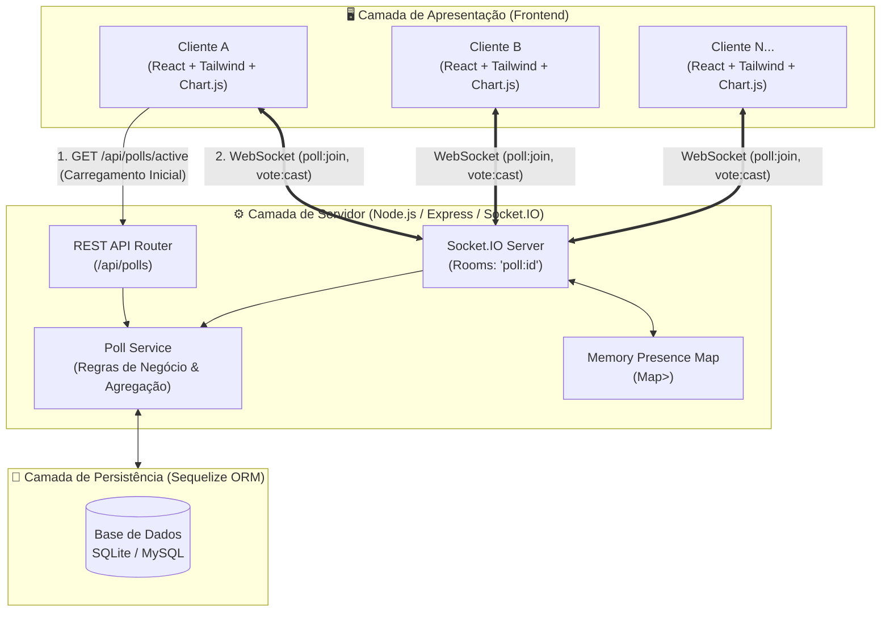
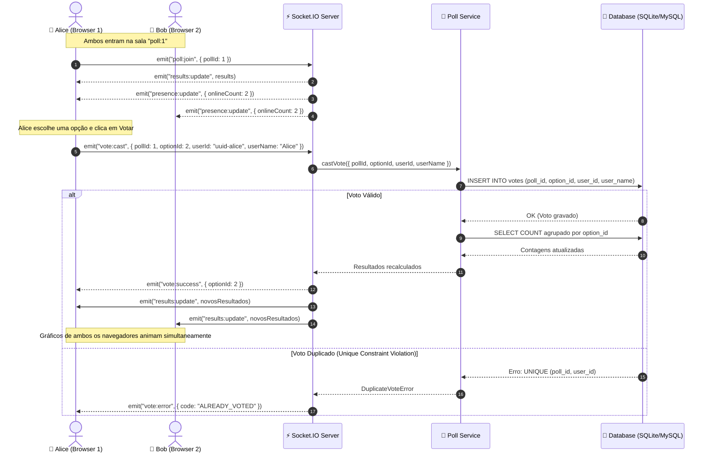

# 📊 Real-Time Poll

> **Aplicação de Votação em Tempo Real** — Sistema distribuído de votação e agregação estatística instantânea com arquitetura orientada a eventos (*event-driven*), garantia de integridade contra votos duplicados em nível de base de dados e sincronização bidirecional via WebSockets.

---

## 📑 Índice

- [Visão Geral](#-visão-geral)
- [Arquitetura do Sistema](#-arquitetura-do-sistema)
  - [Diagrama de Arquitetura Geral](#diagrama-de-arquitetura-geral)
  - [Fluxo de Votação e Broadcast em Tempo Real](#fluxo-de-votação-e-broadcast-em-tempo-real)
  - [Modelo de Dados (ERD)](#modelo-de-dados-erd)
- [Principais Decisões Técnicas](#-principais-decisões-técnicas)
  - [Garantia Contra Votos Duplicados (Race Conditions)](#1-garantia-contra-votos-duplicados-race-conditions)
  - [Cálculo e Agregação Dinâmica](#2-cálculo-e-agregação-dinâmica)
  - [Persistência e Sessão Sem Autenticação Pesada](#3-persistência-e-sessão-sem-autenticação-pesada)
  - [Zero-Config Database: SQLite + Suporte a MySQL](#4-zero-config-database-sqlite--suporte-a-mysql)
- [Stack Tecnológica](#-stack-tecnológica)
- [Estrutura do Repositório](#-estrutura-do-repositório)
- [Como Correr Localmente](#-como-correr-localmente)
  - [Pré-requisitos](#pré-requisitos)
  - [1. Backend (API + WebSockets)](#1-backend-api--websockets)
  - [2. Frontend (React + Vite)](#2-frontend-react--vite)
- [Testar Concorrência e Tempo Real](#-testar-concorrência-e-tempo-real)

---

## 🎯 Visão Geral

- **Sincronização Instantânea**: Vários utilizadores conectados visualizam em simultâneo os gráficos a atualizar-se em tempo real assim que qualquer voto é submetido.
- **Identificação Desacoplada**: Sem palavras-passe ou formulários complexos. O utilizador informa apenas um nome e recebe um UUID persistente via `localStorage`.
- **Prevenção de Votos Duplos**: Garantida atomicamente por *Unique Constraints* na base de dados, tolerante a cliques simultâneos em múltiplas abas ou conexões concorrentes.
- **Métricas de Presença**: Contagem em tempo real de utilizadores conectados na sala da votação.
- **Resiliência e Carregamento Híbrido**: Carregamento inicial rápido via REST (evita telas em branco) combinado com escuta ativa via WebSockets.

---

## 🏛️ Arquitetura do Sistema

### Diagrama de Arquitetura Geral



---

### Fluxo de Votação e Broadcast em Tempo Real



---

### Modelo de Dados (ERD)


> **Índice de Integridade**: `VOTES` possui um índice único composto em `(poll_id, user_id)` garantindo que nenhum registo duplicado passe para a base de dados.

---

## 💡 Principais Decisões Técnicas

### 1. Garantia Contra Votos Duplicados (*Race Conditions*)
- **Problema**: Checagens exclusivamente em memória ou no cliente (*Client-side checks*) falham quando o mesmo utilizador emite cliques muito rápidos em abas diferentes ou sofre oscilações de rede.
- **Solução**: Criada uma restrição única a nível de banco de dados:
  ```sql
  UNIQUE INDEX unique_vote_per_user_per_poll ON votes (poll_id, user_id);
  ```
  Caso duas requisições paralelas cheguem milissegundos uma da outra, o motor da base de dados aceita a primeira e rejeita atomicamente a segunda com `UniqueConstraintError`, mapeado no backend para `DuplicateVoteError`.

### 2. Cálculo e Agregação Dinâmica
- **Fonte Única da Verdade**: Os totais e percentagens não são salvos em contadores mutáveis suscetíveis a dessincronização. Em cada novo voto, uma query agregada `COUNT` é executada:
  ```sql
  SELECT option_id, COUNT(id) as count FROM votes WHERE poll_id = :pollId GROUP BY option_id;
  ```
- **Precisão**: Percentagens calculadas matematicamente com arredondamento a uma casa decimal `(votos / total) * 100`.

### 3. Persistência e Sessão Sem Autenticação Pesada
- Ao carregar a página pela primeira vez, o cliente gera um identificador aleatório seguro (`crypto.randomUUID()`) e salva-o em `localStorage`.
- Se o navegador recarregar, o hook `usePoll` consulta o endpoint `/api/polls/:id/my-vote` e recupera instantaneamente a opção votada, mantendo o estado correto na UI.

### 4. Zero-Config Database: SQLite + Suporte a MySQL
- **Zero Configuração Local**: Por padrão, o backend utiliza **SQLite** gerando o ficheiro local `database.sqlite` sem necessidade de instalar servidores externos de base de dados.
- **Pronto para Produção**: Basta alterar `DATABASE_URL` no `.env` para apontar para um cluster MySQL (`mysql://...`) sem alterar uma única linha de código.

---

## 🛠️ Stack Tecnológica

| Camada | Tecnologia | Propósito / Benefício |
|---|---|---|
| **Frontend Framework** | React 19 + Vite | Renderização rápida com SSR/Lazy safety e inicialização otimizada |
| **Estilização** | Tailwind CSS 4 | Tema *Control Room* escuro com paleta industrial de alto contraste |
| **Gráficos** | Chart.js + react-chartjs-2 | Visualização horizontal reativa com interpolação de cores e animações fluidas |
| **WebSockets** | Socket.IO + Socket.IO-Client | Comunicação bidirecional orientada a salas (*rooms*) com auto-reconexão e fallback HTTP |
| **Backend Runtime** | Node.js + Express 5 | Servidor HTTP moderno com arquitetura modular |
| **ORM / Banco de Dados** | Sequelize + SQLite / MySQL | Mapeamento relacional com suporte híbrido SQLite/MySQL |

---

## 📂 Estrutura do Repositório

```
realtime-poll/
├── backend/
│   ├── src/
│   │   ├── db/
│   │   │   ├── connection.js       # Conexão híbrida Sequelize (SQLite / MySQL)
│   │   │   ├── seed.js             # Script de população da votação de demonstração
│   │   │   └── models/             # Definições dos modelos (Poll, PollOption, Vote)
│   │   ├── routes/
│   │   │   └── poll.routes.js      # Rotas REST (/active, /results, /my-vote)
│   │   ├── services/
│   │   │   └── poll.service.js     # Lógica de negócio, agregações e queries
│   │   ├── sockets/
│   │   │   └── index.js            # Handlers de eventos WebSocket e salas
│   │   └── index.js                # Entrada da aplicação e orquestração HTTP/WS
│   ├── package.json
│   ├── .env.example
│   └── README.md                   # Documentação técnica aprofundada do Backend
│
└── frontend/
    ├── src/
    │   ├── components/
    │   │   ├── LiveBadge.jsx       # Indicador de status de conexão e utilizadores online
    │   │   ├── NameEntry.jsx       # Formulário inicial de identificação do utilizador
    │   │   ├── ResultsChart.jsx    # Gráfico de barras horizontais Chart.js
    │   │   └── VotingPanel.jsx     # Botões e painel de votação
    │   ├── hooks/
    │   │   └── usePoll.js          # Hook de orquestração WebSocket e ciclo de vida
    │   ├── lib/
    │   │   ├── config.js           # Endpoints de API e Socket
    │   │   └── userId.js           # Geração e persistência resiliente de UUID
    │   ├── App.jsx                 # Máquina de estados principal da interface
    │   ├── index.css               # Design tokens Tailwind CSS 4
    │   └── main.jsx
    ├── package.json
    ├── .env.example
    └── README.md                   # Documentação técnica aprofundada do Frontend
```

---

## 🚀 Como Correr Localmente

### Pré-requisitos
- **Node.js**: Versão 18 ou superior (`node -v`)
- **NPM**: Versão 9 ou superior (`npm -v`)

---

### 1. Backend (API + WebSockets)

```bash
cd backend

# 1. Instalar dependências
npm install

# 2. Configurar variáveis de ambiente (já vem pré-configurado para SQLite)
cp -n .env.example .env

# 3. Criar e popular a base de dados de exemplo
npm run seed

# 4. Iniciar o servidor em desenvolvimento
npm run dev
```

> 🌐 Servidor backend ativo em **`http://localhost:4000`** (Healthcheck: `http://localhost:4000/health`)

---

### 2. Frontend (React + Vite)

Abra um novo terminal:

```bash
cd frontend

# 1. Instalar dependências
npm install

# 2. Configurar variáveis de ambiente
cp -n .env.example .env

# 3. Iniciar o frontend
npm run dev
```

> 🌐 Interface disponível em **`http://localhost:5173`**

---

## 🧪 Testar Concorrência e Tempo Real

1. Abra `http://localhost:5173` no navegador normal e insira o nome **Alice**.
2. Abra `http://localhost:5173` numa **janela anónima** (ou noutro navegador) e insira o nome **Bob**.
3. Observe o badge superior: ambos mostrarão **`2 online`**.
4. Vote com a **Alice**: instantaneamente, a janela do **Bob** atualiza o gráfico com animação e recalcula as percentagens em tempo real, sem necessidade de recarregar a página!
5. Se a **Alice** tentar votar novamente na mesma sessão, o sistema bloqueia no cliente e rejeita na base de dados caso uma requisição direta seja forçada.

