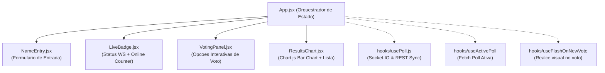
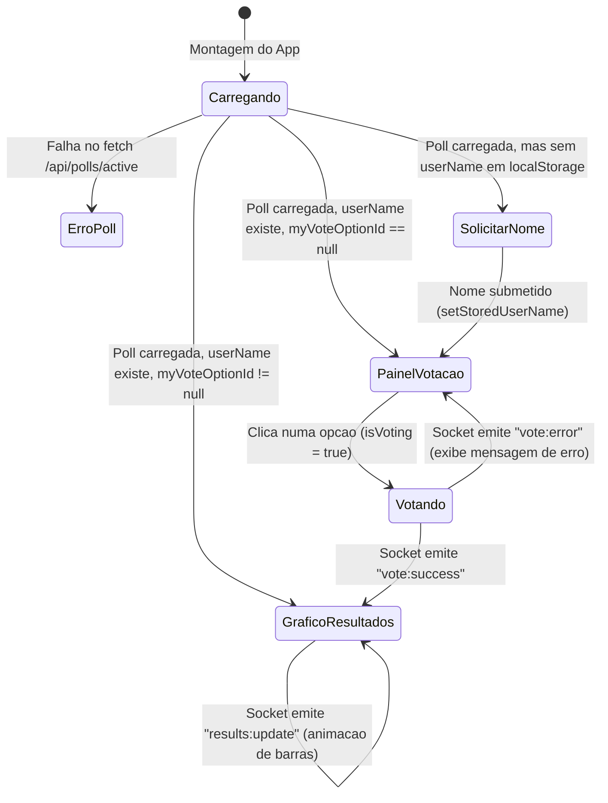

# Real-Time Poll — Frontend Application

> **Interface Reativa em React 19 + Tailwind CSS 4** — Visualizacao dinamica de votacoes em tempo real com renderizacao fluida de graficos via Chart.js, sincronizacao de estado com Socket.IO e design system tematico *Control Room*.

---

## Indice

- [Arquitetura do Frontend](#arquitetura-do-frontend)
  - [Arvore de Componentes](#arvore-de-componentes)
  - [Maquina de Estados da Interface](#maquina-de-estados-da-interface)
- [Camada de Hooks Customizados](#camada-de-hooks-customizados)
  - [`usePoll`](#usepoll)
  - [`useActivePoll`](#useactivepoll)
  - [`useFlashOnNewVote`](#useflashonnewvote)
- [Design System & Estilizacao (Tailwind CSS 4)](#design-system--estilizacao-tailwind-css-4)
  - [Paleta *Control Room*](#paleta-control-room)
  - [Tipografia Estrategica](#tipografia-estrategica)
  - [Micro-Interacoes e Animacoes CSS](#micro-interacoes-e-animacoes-css)
- [Resiliencia e Tratamento de Erros](#resiliencia-e-tratamento-de-erros)
- [Scripts Disponiveis](#scripts-disponiveis)

---

## Arquitetura do Frontend

### Arvore de Componentes

---

### Maquina de Estados da Interface

O componente [`App.jsx`](file:///media/manhica/ManhicaIsley/Poll%20full/realtime-poll-full/frontend/src/App.jsx) atua como a maquina de estados central da aplicacao:

---

## Camada de Hooks Customizados

### `usePoll`
Localizado em [`src/hooks/usePoll.js`](file:///media/manhica/ManhicaIsley/Poll%20full/realtime-poll-full/frontend/src/hooks/usePoll.js):
- **Responsabilidade**: Orquestra toda a comunicacao WebSocket e a hidratacao REST da votacao.
- **Ciclo de Vida**:
  1. **Hidratacao REST Imediata**: Ao montar, faz `fetch` para `/my-vote` e `/results`. Isso garante que o utilizador veja resultados e o estado "ja votei" antes mesmo do handshake do WebSocket terminar.
  2. **WebSocket Handshake**: Instancia o cliente Socket.IO e emite `poll:join` logo apos a conexao.
  3. **Event Listeners**: Escuta `results:update` (atualizacao dos dados), `presence:update` (contagem de utilizadores online), `vote:success` e `vote:error`.
  4. **Cleanup**: Desconecta o socket ao desmontar o componente ou mudar de `pollId`.

---

### `useActivePoll`
Localizado em [`src/App.jsx`](file:///media/manhica/ManhicaIsley/Poll%20full/realtime-poll-full/frontend/src/App.jsx#L10-L29):
- Efetua o `GET /api/polls/active` com protecao contra *race conditions* de cancelamento (`cancelled = true`).

---

### `useFlashOnNewVote`
Localizado em [`src/App.jsx`](file:///media/manhica/ManhicaIsley/Poll%20full/realtime-poll-full/frontend/src/App.jsx#L31-L53):
- Compara o snapshot anterior de resultados com o atual (`useRef(results)`).
- Quando os votos de uma opcao especifica aumentam, ativa um estado transitorio `flashOptionId` por 500ms, disparando uma animacao CSS de pulso na linha correspondente da legenda.

---

## Design System & Estilizacao (Tailwind CSS 4)

A interface adota a estetica industrial **"Control Room"** — inspirada em consolas de monitorizacao de missao critica.

### Paleta *Control Room*
Definida em [`src/index.css`](file:///media/manhica/ManhicaIsley/Poll%20full/realtime-poll-full/frontend/src/index.css#L3-L22) usando `@theme` nativo do Tailwind CSS 4:

| Variavel | Hex | Significado Semantico |
|---|---|---|
| `--color-bg` | `#12151B` | Fundo carvao profundo |
| `--color-surface` | `#1A1F27` | Cartoes e containers elevados |
| `--color-surface-raised` | `#212733` | Hover states e inputs |
| `--color-border` | `#2A3140` | Bordas suteis de baixo contraste |
| `--color-signal` | `#35D48C` | **Verde-sinal exclusivo para status "AO VIVO"** |
| `--color-signal-dim` | `#1F5C41` | Selecao de texto e badges de voto |
| `--color-danger` | `#E5566B` | Erros e validacoes |

---

### Tipografia Estrategica
- **Titulos (`--font-display`)**: `Space Grotesk` (geometrica e imersiva).
- **Corpo (`--font-body`)**: `Inter` (maxima legibilidade).
- **Numeros e Badges (`--font-mono`)**: `JetBrains Mono` com `tabular-nums` para evitar saltos visuais durante a contagem em tempo real.

---

### Micro-Interacoes e Animacoes CSS
- `pulse-dot` e `pulse-ring`: Efeito de radar pulsante no badge `Ao vivo`.
- `bar-flash`: Realce de brilho quando novos votos sao recebidos.
- Suporte total a `prefers-reduced-motion: reduce` para acessibilidade.

---

## Resiliencia e Tratamento de Erros

1. **Protecao de Armazenamento Local (`localStorage`)**:
   Em [`src/lib/userId.js`](file:///media/manhica/ManhicaIsley/Poll%20full/realtime-poll-full/frontend/src/lib/userId.js), todas as leituras e escritas sao envolvidas em blocos `try/catch`. Caso o utilizador esteja em modo de navegacao ultra-restrita ou iframe sem permissoes de storage, a aplicacao gera um identificador volatil sem quebrar a execucao.
2. **Prevencao de Render Warnings no React 19**:
   Inicializacao de estados persistentes com *lazy initializers* (`useState(getUserId)`), respeitando o compilador do React 19.

---

## Scripts Disponiveis

| Comando | Descricao |
|---|---|
| `npm start` | Inicia o servidor Vite em `http://localhost:5173` |
| `npm run dev` | Inicia o servidor Vite em modo de desenvolvimento |
| `npm run build` | Compila o bundle de producao na pasta `dist/` |
| `npm run lint` | Executa o linter ultra-rapido `oxlint` (0 erros / 0 avisos) |
| `npm run preview` | Executa o servidor local de visualizacao da build de producao |

